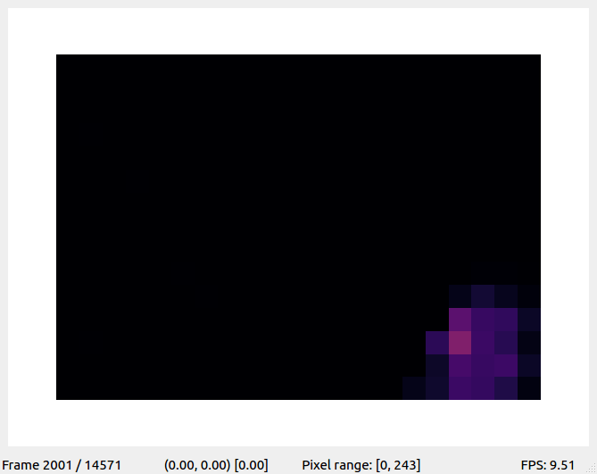

This repository contains the code for the article _Efficient Anomaly Detection in a Laser Surface
Heat Treatment Process by Tracking the Laser Spot_. The article proposes the algorithm _Kernel Density Estimation - Anomaly Movement Detector (KDE-AMD)._

This repository contains the source code for the experiments of the manuscript.

It implements the following algorithms:

- KDE-AMD (kde_amd.py)
- Global KDE (global_kde.py)
- _D_-Markov machine (dmarkov_machine.py)
- Kalman filter (kalman_filter.py)
- Deep neural network (deep_neural_network_positions.py)

# Repository structure

## `data/`

Contains the data of the laser heat treatment. It should have a subfolder for each batch type (Type1, ..., Type36). See the data [README](data/README.MD) for details on the structure of the data.

## `nn_positions_models/`

This folder contains the trained models for the deep learning network. Inside this folder it should be a subfolder for each batch type. A model is saved here for each epoch the deep network learning improves the validation score.

As the deep neural network is evaluated using a 2-fold cross validation. The models should have the names:

`Type{n}_{first|second}_{epoch}_{mse}`

where `n` is the number of epoch (from 1 to 36). 

`{first|second}` is `first` for the first model and `second` for the second model in the 2-fold cross-validation.

`epoch` is the number of the epoch.

`mse` is the mean squared error in validation.


## `results/`

Contains the results of the execution of each algorithm. An anomaly score is calculated for each video and algorithm. It should have a subfolder for each algorithm:

- `results/KDEAMD/`
- `results/GlobalKDE/`
- `results/DMarkovMachine/`
- `results/KalmanFilter/`
- `results/DeepNeuralNetworkPosition/`

For each subfolder it should be a subfolder for each batch type.

Inside the batch type subfolders, the results are saved as csv files containing the anomaly score computed for each video in the batch.

For the algorithms which can have different parameter values, the names provides the selected configuration and if the tested videos were altered with noise.

- For the _KDE-AMD_ algorithm, the name should be of the form `KDEAMD_{R}_{C}_{λ}_{configuration}`.

    where `R`,  `C` and `λ` are the parameters of the algorithm.

- For the Global KDE algorithm, the name should be of the form `GlobalKDE_{configuration}`

- For the _D_-Markov machine algorithm, the name should be of the form `DMarkovMachine_{R}_{C}_{D}_{SymbolizationType}_({DivisionOrder})?_{configuration}`

    where `R` and `C` are the number of rows and columns to divide the space in the symbolization phase. `D` is the Markov order of the _D_-Markov machine.

    `SymbolizationType` is the type of symbolization applied. There are three possibilities:

    - `EW` if the symbolization is equal width.
    - `EF` if the symbolization is equal frequency.
    - `EFNB` if the symbolization is equal frequency no bounds. A version of equal frequency where the limits of the space are selected using the limits of the data.
    
    `DivisionOrder` is only used for the equal frequency and equal frequency no bounds symbolization types. It determines the order in which is axis is partitioned. The possible values are:
    - `RC` which stands for "Rows then Columns"
    - `CR` which stands for "Columns then Rows"
- For the Kalman filter, the name should be `KalmanFilter_{configuration}`.
- For the deep neural network, the name should be `DeepNeuralNetworkPosition_{configuration}`.

For all the algorithms `configuration` indicates if the data was unaltered or Gaussian noise was introduced to simulate anomalies. The possible values are:

- `normal` for unaltered data.
- `gaussian002` for altered data with Gaussian noise with 0.02 variance.

### Some examples

- `KDEAMD_35_35_15_normal` is the execution of the _KDE-AMD_ algorithm with the parameters `R = 35`, `C = 35` and `λ = 15` tested with unaltered data.

- `DMarkovMachine_40_40_1_EW_gaussian002` is the execution of the _D_-Markov machine with the parameters `R = 35`, `C = 35`, `D = 1` and symbolization using equal width in data altered with Gaussian noise.
    
- `DMarkovMachine_20_20_1_EFNB_RC_normal` is the execution of the _D_-Markov machine with the parameters `R = 20`, `C = 20`, `D = 1`, using symbolization equal frequency no bounds and dividing first by the rows in data altered with unaltered data.

## `analyze_results.py`

This file includes code to read the result files from the `result/` folder and extract useful information. For example, you can plot the ROC curves and calculate the AUC.

## `classification_times.py`

Measure the classification time of each algorithm. The measured classification time is the mean of the classification time
for all the videos in batch 1.

Take into account that times may change with other batches.

**Note: The execution could be really slow because there are too many algorithms/parameter configurations. Edit the `__main__` code accordingly.**


## Algorithms code

The code which implements all the algorithms `kde_amd.py` `global_kde.py`, `dmarkov_machine.py`, `kalman_filter.py` and `deep_neural_network_positions.py` have always the same structure:

- An `evaluateModel()` function which receive the input data to be classified, the parameters of the algorithm and a output file name for the results. It executes the evaluation defined for each algorithm (leaving-one-out, 2-fold cross validation, hold-out, ...) and saves the results.
- A class implementing each algorithm which:
    - Receives an `ObservationROISet` (see the documentation in `observation_set.py`) and trains the model.
    - Has a method `evaluateObservation()` which returns the anomaly score for a given video.

See the `__main__` code to see some examples on how to use the code.


## `misc.py`

It implements the laser spot position estimation with the weighted mean.

## `observations_set.py`

It implements a dataframe-like structure to work with "observations" (a set of videos represented by their laser spot positions).

It also implements some helpful methods for some algorithms and contains classes to make the symbolization of the _D_-Markov machine algorithm.  

## `play_video.py`

It implements the visualization of the videos. This is not necessary to reproduce the experiments, but a useful utility. It requires the files `play_video_ui.py` and `play_double_video_ui.py`.

Playing a single video:



Playing two videos side-by-side:


The controls for the visualizer are:

- <kbd>Space</kbd> - Pause/Resume.
- <kbd>&#8592;</kbd> - Play backwards.
- <kbd>&#8594;</kbd> - Play forwards.
- <kbd>&#8593;</kbd> - Increase speed.
- <kbd>&#8595;</kbd> - Decrease speed.
- <kbd>R</kbd> - Reset view (if zoom in/out was applied). 
- <kbd>E</kbd> - Manual skip frame. Forward/backwards depending on the current playback status.
- <kbd>Q</kbd> - Move 500 frames backwards.
- <kbd>W</kbd> - Move 500 frames forward.
- <kbd>A</kbd> - Move 10 frames backwards.
- <kbd>S</kbd> - Move 10 frames forward.
- <kbd>N</kbd> - Change pixel range (affects the colors) in left image.
- <kbd>M</kbd> - Change pixel range (affects the colors) in right image.
- <kbd>C</kbd> - Change colormap.
- <kbd>T</kbd> - Reset the video to the first frame and pauses the playback.
- <kbd>Mouse wheel</kbd> - Zoom in/out (it could not work with PyQt5).

# Installation

The code is written in `Python 3.7` and `Ubuntu 16.04`. Other Python 3 versions and operating systems should work nicely, but they are not tested.

The required packages are:

```
numpy
scipy
keras
tensorflow
sklearn
pandas
matplotlib
tikzplotlib
```

You can install them easily:

```
pip install numpy scipy keras tensorflow sklearn pandas matplotlib tikzplotlib
```

To execute the `play_video.py` functionality, some additional dependencies are needed:

```
pyqtgraph
PyQt4/PyQt5
```

Again, you can install them with pip:

```
pip install pyqtgraph PyQt5
```